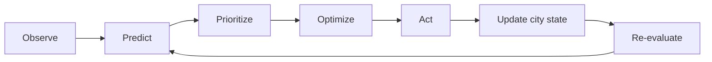
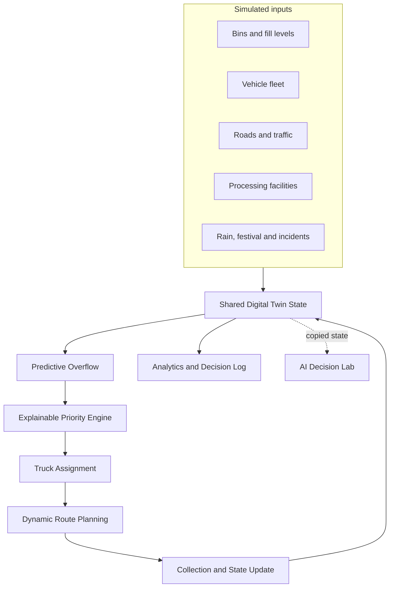

<div align="center">

# AI-WasteTwin

### Explainable Urban Waste-Management Digital Twin

**Predict overflow. Prioritize bins. Dispatch suitable trucks. Re-evaluate continuously.**

[](#technology-stack)
[](#getting-started)
[](#data-and-ai-transparency)
[](#explainable-priority-engine)

A deterministic decision-support simulation for adaptive municipal waste collection in **Chhatrapati Sambhajinagar, Maharashtra**.

[Watch the local project guide](assets/ai-wastetwin-guide.mp4)

</div>

> [!IMPORTANT]
> AI-WasteTwin is an **academic simulation prototype**. It uses synthetic city data and does not present live municipal measurements, verified savings, or field-tested AI accuracy.

<p align="center">
  
</p>

---

## Table of contents

- [Overview](#overview)
- [Problem statement](#problem-statement)
- [Project objective](#project-objective)
- [Core operating loop](#core-operating-loop)
- [Key capabilities](#key-capabilities)
- [System architecture](#system-architecture)
- [Simulation model](#simulation-model)
- [Explainable priority engine](#explainable-priority-engine)
- [Dynamic multi-bin collection](#dynamic-multi-bin-collection)
- [Predictive overflow](#predictive-overflow)
- [Continuous route replanning](#continuous-route-replanning)
- [Smart facility selection](#smart-facility-selection)
- [Incident and crisis handling](#incident-and-crisis-handling)
- [AI Decision Lab](#ai-decision-lab)
- [Citizen reporting and waste classification](#citizen-reporting-and-waste-classification)
- [Analytics](#analytics)
- [Simulated area profiles](#simulated-area-profiles)
- [Application sections](#application-sections)
- [Guided demonstration](#guided-demonstration)
- [Getting started](#getting-started)
- [Project structure](#project-structure)
- [Technology stack](#technology-stack)
- [Data and AI transparency](#data-and-ai-transparency)
- [Current limitations](#current-limitations)
- [Roadmap](#roadmap)
- [Image credits](#image-credits)
- [Author](#author)

---

## Overview

AI-WasteTwin creates a local virtual representation of a municipal waste system. Bins, collection vehicles, roads, facilities, incidents and analytics share one continuously updated simulated city state.

The system forecasts future bin fill, identifies overflow risk, calculates a transparent priority score, assigns suitable vehicles, replans routes after changes and records why each decision was made.

### Simulated city at a glance

| Component | Configuration |
|---|---:|
| Waste bins | 100 |
| Collection trucks | 8 |
| Simulation zones | 6 |
| Processing facilities | 2 |
| Simulation step | 10 minutes |
| Prediction horizon | 90 minutes |
| Normal truck threshold | 90% load |
| Bin status levels | 7 |

---

## Problem statement

Traditional waste collection commonly relies on fixed schedules and predetermined routes. These plans may react late when:

- waste generation changes by time, location or event;
- a bin is predicted to overflow before its scheduled collection;
- traffic increases or a road becomes unavailable;
- a collection truck breaks down;
- rainfall or festivals change waste and travel conditions;
- processing facilities approach their operating capacity.

A fixed collection plan can therefore create delayed service, unnecessary dump trips, uneven vehicle utilization and avoidable overflow risk.

---

## Project objective

The project demonstrates how an adaptive waste-management system can:

1. observe a shared city state;
2. forecast future bin conditions;
3. prioritize the most important collection tasks;
4. assign feasible vehicles;
5. collect multiple suitable bins per trip;
6. adapt routes when conditions change;
7. select an appropriate processing facility;
8. explain every decision; and
9. compare simulated outcomes with fixed scheduling.

The prototype is designed for safe experimentation before any real-world deployment.

---

## Core operating loop



Every collection, breakdown, road closure, capacity change or new critical bin can change the next decision.

---

## Key capabilities

### City Digital Twin

- Shared state for bins, vehicles, zones, roads and facilities
- Physical, Data and AI visualization layers
- Seven-level bin status system
- Animated truck routes, hotspots and facility markers
- Zone and risk filters
- Clickable bin inspection with decision factors

### Predictive and explainable decisions

- 90-minute future-fill forecast
- Pre-overflow dispatch instead of waiting for 100% fill
- Transparent priority score from 0 to 100
- Plain-language `WHY?` explanations
- Current target, next target and route-version visibility
- Chronological AI Decision Log

### Adaptive operations

- Dynamic multi-bin collection
- Continuous route replanning
- Smart processing-facility selection
- Capacity-aware assignment
- Duplicate-assignment prevention
- Emergency overflow-risk override

### Planning and evaluation

- AI Decision Lab using a copy of the live state
- Scenario comparison
- Minimum-fleet estimation
- AI versus fixed-scheduling comparison
- Historical replay and JSON report export

---

## System architecture



### Architectural principle

The application uses **one shared simulation engine**. The Decision Lab receives a copied state for what-if analysis rather than creating or modifying a second live city.

---

## Simulation model

The simulation advances in deterministic 10-minute steps.

For each step, the engine:

1. applies waste-growth modifiers;
2. updates bin fill levels;
3. forecasts future fill;
4. recalculates risk and priority;
5. checks available vehicles;
6. updates movement and collection;
7. re-evaluates nearby bins;
8. selects facilities when dumping is required;
9. records metrics and decision-log entries; and
10. stores state for replay.

### Waste-generation modifiers

The model can adjust generation and operations for:

- zone profile;
- heavy or light rain;
- festival activity;
- waste surge;
- road closure;
- truck availability; and
- facility-capacity reduction.

The random-looking city is generated from a fixed seed where practical, keeping demonstrations reproducible.

---

## Explainable priority engine

Each bin receives a normalized score out of 100.

| Decision factor | Maximum contribution |
|---|---:|
| Predicted overflow probability | 30 |
| Current fill level | 25 |
| Waste growth rate | 15 |
| Zone importance | 10 |
| Distance and route efficiency | 12 |
| Special conditions | 8 |
| **Total** | **100** |

Example:

```text
Bin: B-104
Current fill: 91%
Overflow probability: 94%
Growth: High
Estimated distance: 1.2 km
Priority: 92 / 100
Decision: Collect
```

The interface exposes the score breakdown instead of presenting an unexplained result.

---

## Dynamic multi-bin collection

The main operational innovation is continuous re-evaluation after every pickup.

### Conventional behavior

```text
Collect one bin -> Dump -> Return -> Collect another bin
```

### AI-WasteTwin behavior

```text
Collect -> Update state -> Re-evaluate nearby bins
        -> Collect another suitable bin if possible
        -> Repeat until capacity or operational limits
        -> Select the best processing facility
```

### Collection decision sequence

1. Update truck load.
2. Reset the collected bin state.
3. Find nearby unassigned candidate bins.
4. Recalculate each candidate's priority.
5. Check remaining vehicle capacity.
6. Check predicted overflow risk.
7. Check route efficiency and detour.
8. Select the best next bin.
9. Recalculate the route and ETA.
10. Continue until no suitable bin remains or the truck approaches its normal threshold.
11. Route the truck to the best compatible facility.

The normal operating threshold is approximately **90% vehicle load**. A very high-risk nearby bin can receive an emergency override when enough capacity remains.

Assigned bins are removed from other trucks' candidate lists, preventing duplicate collection.

---

## Predictive overflow

The system does not wait for a bin to reach 100%.

A future-fill estimate uses:

```text
Predicted fill = current fill
               + generation rate x forecast time
               / bin capacity
               x active modifiers
```

The current prototype evaluates a 90-minute horizon and provides:

- predicted fill percentage;
- estimated time to overflow;
- overflow probability;
- risk category; and
- recommended action.

This forecast is deterministic and formula-based. It is not presented as a trained machine-learning model.

---

## Continuous route replanning

A route can be recalculated when:

- a bin is collected;
- a new critical bin appears;
- another truck takes an assignment;
- road conditions change;
- a road closes;
- a truck breaks down;
- truck capacity changes; or
- a processing facility changes status.

The interface records the route version and provides a plain-language reason for the update.

---

## Smart facility selection

When a truck must unload, the facility-selection logic considers:

- route distance;
- current facility load;
- available capacity;
- traffic conditions;
- operational status; and
- waste compatibility.

A nearer facility may be skipped when it is almost full, unavailable or incompatible with the truck's collected material.

---

## Incident and crisis handling

Supported simulated events include:

| Event | System response |
|---|---|
| Heavy rain | Adjusts waste growth and travel conditions |
| Festival | Increases activity in relevant areas |
| Road closure | Recalculates affected routes |
| Truck breakdown | Marks the truck unavailable and redistributes its assignments |
| Waste surge | Recalculates forecasts and priorities |
| Facility reduction | Re-evaluates processing-site selection |
| City Crisis | Activates multiple disruptions in one reproducible scenario |

During a truck breakdown, assigned bins return to the queue, available trucks are reconsidered, routes and ETAs are recalculated, and the response is added to the decision log.

---

## AI Decision Lab

The Decision Lab answers a different question from the live Digital Twin:

| Layer | Question |
|---|---|
| Digital Twin | What is happening now? |
| AI Decision Lab | What could happen if conditions change? |

The lab runs on a **copy of the current city state**, so experiments do not alter the live simulation.

### What-if inputs

- number of available trucks;
- waste-generation increase;
- rainfall;
- festival activity;
- road closures;
- truck failures; and
- processing capacity.

### Outputs

- projected overflow risk;
- number of critical bins;
- collection delay;
- required trucks;
- processing-facility demand;
- route distance; and
- dump trips.

### Minimum Fleet Analysis

The lab can test different fleet sizes against targets such as:

- maximum overflow risk; and
- maximum collection delay.

The result is clearly labelled as a **simulation estimate**.

---

## Citizen reporting and waste classification

The prototype includes a simulated citizen-reporting workflow:

```text
Reported -> Verified -> Assigned -> Dispatched -> Collected -> Resolved
```

Reports can include a location, issue type, description and optional image reference.

Waste categories include:

- organic;
- plastic;
- paper;
- glass;
- metal;
- e-waste;
- hazardous; and
- mixed waste.

The current classification is rule-based. Waste type can influence facility compatibility and routing recommendations.

---

## Analytics

The analytics section reports simulated operational outcomes including:

- bins collected;
- overflow events;
- predicted overflows prevented;
- average response time;
- vehicle utilization;
- average bins per dump trip;
- dump trips;
- total route distance;
- simulated fuel or operating cost;
- recovered waste; and
- facility load.

### AI versus fixed scheduling

Both approaches can be compared from the same simulated starting conditions. This supports a fairer demonstration of route distance, overflow, delay and utilization without presenting the results as real municipal statistics.

---

## Simulated area profiles

Area profiles make commercial and operational assumptions visible inside the simulator.

| Zone | Simulated profile | Commercial intensity |
|---|---|---:|
| Central Area | Commercial core | 94% |
| Jalna Road | Commercial corridor | 86% |
| CIDCO | Mixed commercial and residential | 68% |
| Beed Bypass | Logistics and mixed use | 52% |
| Waluj | Industrial | 38% |
| Urban Fringe | Mostly residential | 24% |

Commercial intensity contributes to deterministic waste-growth and zone-priority assumptions. It does not replace current fill, forecast risk or route efficiency.

> [!NOTE]
> These profiles are transparent demonstration assumptions, not official government classifications.

---

## Application sections

| Section | Purpose |
|---|---|
| Dashboard | High-level city status, KPIs, map and priority queue |
| Digital Twin | Full city map with Physical, Data and AI layers |
| Simulation | Live operation, guided story, incidents and decision log |
| AI Predictions | Forecasts, risk, score breakdown and anomaly monitoring |
| Vehicles & Routes | Fleet status, truck capacity, routes and facilities |
| AI Decision Lab | What-if planning and minimum-fleet analysis |
| Analytics | Simulated operational results and AI-versus-fixed comparison |
| How It Works | Project explanation and local guide video |

---

## Guided demonstration

The Guided / Visitor mode presents the complete story automatically:

```text
City starts
-> Bin fill rises
-> Overflow is predicted
-> Priority is calculated
-> Truck is dispatched
-> Bin is collected
-> Nearby bins are re-evaluated
-> The truck collects another suitable bin
-> Vehicle capacity approaches its threshold
-> A processing facility is selected
-> A disruption triggers route replanning
-> The city stabilizes
```

Controls include:

- Start Guided Demo
- Pause / Resume
- Skip Step
- Exit Demo
- Reset
- Replay
- Visitor Mode
- Expert Mode

The `WHY?` control explains important selections in plain language.

---

## Getting started

### Requirements

No package installation, database, account or cloud service is required.

Use any modern browser and one of the following:

- Python 3;
- Python 2 / alternative local server; or
- the included platform launch script.

### Option 1: Python local server

```bash
git clone https://github.com/Gauravwakle96/Ai-WasteTwinn.git
cd Ai-WasteTwinn
python3 -m http.server 8000
```

Open:

```text
http://localhost:8000
```

On Windows, `python` may be used instead of `python3`.

### Option 2: Included launch scripts

Linux / macOS:

```bash
chmod +x start.sh
./start.sh
```

Windows:

```text
Double-click start.bat
```

### Option 3: Direct file

Open `index.html` directly. A local web server is recommended for the most consistent media and browser behavior.

---

## Project structure

```text
Ai-WasteTwinn/
├── index.html                     # Application structure and all sections
├── styles.css                     # Responsive green, yellow and gold UI
├── app.js                         # Shared simulation and decision engine
├── start.sh                       # Linux / macOS launcher
├── start.bat                      # Windows launcher
├── README.md                      # Project documentation
└── assets/
    ├── ai-wastetwin-guide.mp4     # Local explainer video
    ├── aurangabad-hero.webp       # Homepage city image
    ├── waste-truck.webp           # Collection context image
    └── smart-bins.webp            # Waste-bin context image
```

---

## Technology stack

| Technology | Use |
|---|---|
| HTML5 | Semantic application structure |
| CSS3 | Responsive layout, visual system and animation |
| Vanilla JavaScript | Simulation, prediction, routing and UI state |
| SVG | City map, bins, routes, facilities and charts |
| Local MP4 / WebP assets | Offline media and visual context |

### Design choices

- No framework dependency
- No build step
- No external API requirement
- No database requirement
- Local and offline operation
- Lightweight static deployment
- Responsive desktop and mobile layouts

---

## Data and AI transparency

AI-WasteTwin deliberately separates demonstrated capability from future research.

### Currently implemented

- deterministic simulated data;
- formula-based future-fill prediction;
- explainable multi-factor priority scoring;
- rule-based assignment and incident handling;
- capacity-aware multi-bin collection;
- transparent what-if calculations; and
- simulation-based analytics.

### Not claimed

- live municipal data;
- field-validated prediction accuracy;
- trained computer-vision accuracy;
- guaranteed cost or fuel savings;
- autonomous real-world vehicle control; or
- production deployment readiness.

This transparency is part of the project's explainability objective.

---

## Current limitations

- Synthetic city, traffic and waste data
- Formula-based forecast rather than a calibrated local ML model
- Simplified route geometry and traffic representation
- No live GPS, IoT bin sensor or municipal GIS integration
- Rule-based image/waste classification
- No real operational cost calibration
- No controlled field trial or external validation

---

## Roadmap

### Short term

- Improve accessibility and keyboard operation
- Add more replay checkpoints and export options
- Expand scenario comparison and sensitivity analysis
- Add unit tests for scoring, assignment and incident rules

### Medium term

- Integrate verified offline GIS road data
- Import real bin and facility locations with authorization
- Calibrate generation rates using historical local data
- Add routing constraints for vehicle type and waste compatibility

### Long term

- Connect IoT fill sensors and vehicle GPS
- Train and validate local forecasting models
- Add secured municipal roles and audit logs
- Conduct controlled pilot evaluation with real operators

---

## Image credits

Homepage photographs are stored locally for offline use.

- [Aurangabad Bibi ka Maqbara](https://commons.wikimedia.org/wiki/File:Aurangabad_Bibi_ka_Maqbara.jpg) — Shishirdasika, **CC BY-SA 4.0**
- [Waste collection truck](https://commons.wikimedia.org/wiki/File:Waste_collection_truck.jpg) — W84jon, **CC0**
- [Public waste-segregation bins, Amritsar](https://commons.wikimedia.org/wiki/File:Photograph_of_public-waste_segregation_bins,_Amritsar,_Punjab,_India,_8_April_2023.jpg) — MaplesyrupSushi, **CC BY-SA 4.0**

Images are sourced from Wikimedia Commons. The image licenses apply to the respective photographs.

---

## Author

**Gaurav Fakirrao Wakle**<br>
Computer Science and Engineering<br>
Maharashtra Institute of Technology, Aurangabad City

GitHub: [@Gauravwakle96](https://github.com/Gauravwakle96)

---

<div align="center">

### City condition -> Prediction -> AI decision -> Action -> Result

**Local / Offline · Simulated Data · Explainable Logic**

</div>
